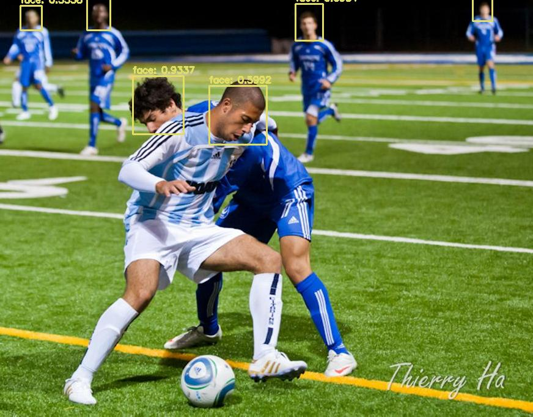
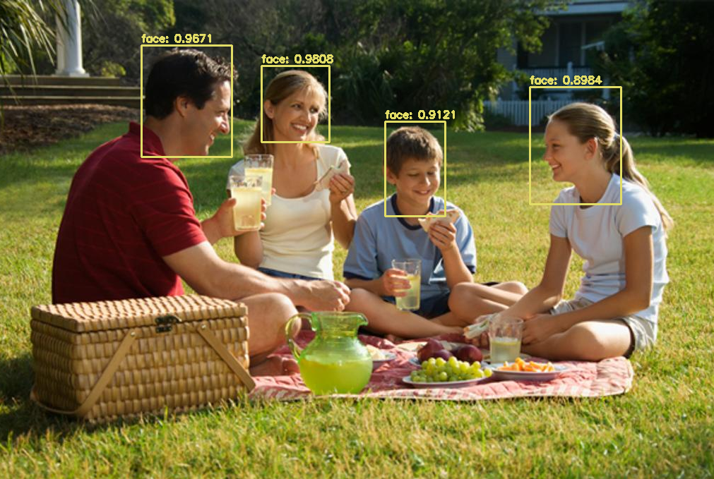

# FaceDection




## Intro
Yolo + OpenCV face detection system based on transfer learning (work in progress)

## Transfer learning
First of all if you want to train your own dataset, I highly recommand to train on the WinderFace dataset: <a href="http://shuoyang1213.me/WIDERFACE/">download</a> It has a large amount of varied images of faces.


### Before using the transfer learning script
The first time you will have to label your data by yourself. You chouse the best x images and label them with an annotation tool and train them with <a href='https://pjreddie.com/darknet/yolo/'>YOLO</a>. After training for the first time you can use those weights in the transfer learning script.


### Steps
1. Place all necessary files e.g. obj.data, obj.names, weights from first training and the yolo cfg file in the yolo-coco folder

 

```
$ cd trasnferLearning
```

```
$ python object_detection.py <image folder>
```

2. This gives an output of box annotations in the folder transferLearning/labels. These annotations can be verified using an annotation tool.

